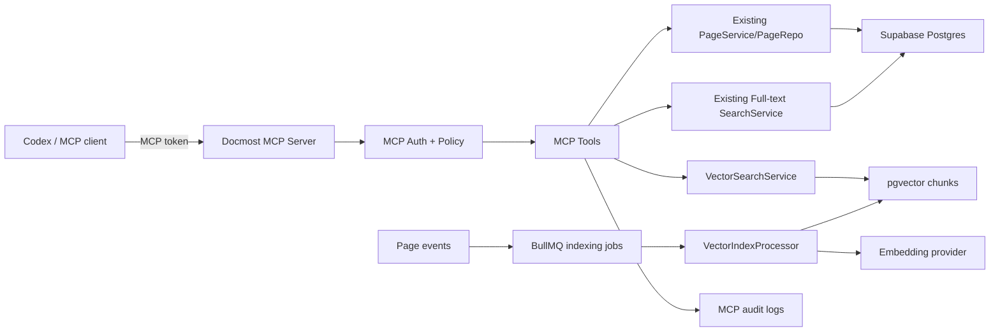

# Docmost MCP and Vector Search Detailed Design

## 0. Source Summary And Intake Check

### 0.1 Source Summary

| Source             | Type         | What it contributes                                                                                                                     | Reliability | Notes                                                                                                  |
| ------------------ | ------------ | --------------------------------------------------------------------------------------------------------------------------------------- | ----------- | ------------------------------------------------------------------------------------------------------ |
| User conversation  | Requirement  | Docmost should act as a Yuque-like personal knowledge base; Codex should access it through MCP                                          | High        | Direct product goal                                                                                    |
| User conversation  | Requirement  | MCP must support high-permission CRUD over pages/posts but must have per-space switches for search, read, write, delete, and indexing   | High        | This is the primary security boundary                                                                  |
| Current clean fork | Code context | Existing Docmost page, space, search, audit, API key, and queue patterns                                                                | High        | Inspected in `apps/server/src/core` and `apps/server/src/database/migrations`                          |
| Current clean fork | Code context | Current search is PostgreSQL full-text search; vector-search artifacts exist but full implementation is absent after enterprise cleanup | High        | `pgvector`, `page_embeddings` types, and AI queue constants remain, but no complete embedding pipeline |

### 0.2 Clarification Block

| ID   | Topic                | Gap                                                                                       | Current handling                                                                      |
| ---- | -------------------- | ----------------------------------------------------------------------------------------- | ------------------------------------------------------------------------------------- |
| C-01 | MCP transport        | Whether final MCP endpoint is stdio, HTTP SSE, Streamable HTTP, or both is not yet chosen | Design supports HTTP-first for deployment and stdio adapter later                     |
| C-02 | Embedding provider   | Final embedding provider may be OpenAI, OpenAI-compatible proxy, or local model           | Use OpenAI-compatible configuration abstraction                                       |
| C-03 | Docmost API exposure | Whether MCP should call internal services directly or public REST APIs                    | In-repo Nest module calls internal services; external deployment may use REST adapter |
| C-04 | UI management        | Whether MCP token and permissions need a UI in phase 1                                    | Phase 1 supports admin API/seed command first; UI can follow                          |

### 0.3 Intake Check

| Check item                                     | Status  | Notes                                                                                 |
| ---------------------------------------------- | ------- | ------------------------------------------------------------------------------------- |
| Business goal is explicit                      | Yes     | Build a personal knowledge-base backend that Codex can search and maintain            |
| Non-goals are explicit                         | Partial | Enterprise AI features and license bypass are out of scope; UI polish is phase 2      |
| Participating systems and callers are known    | Yes     | Codex/MCP client, Docmost server, Supabase Postgres, pgvector, embedding provider     |
| Existing module/process to reuse is identified | Yes     | PageService, PageRepo, SearchService, SpaceAbility/PageAccess patterns, audit, BullMQ |
| Persistence impact is known                    | Yes     | New MCP client, permission, audit, chunk, and indexing job tables                     |
| Compatibility/migration constraints are known  | Partial | Existing pages need backfill; no old MCP clients exist                                |
| Permission/audit requirements are known        | Yes     | Per-token, per-space, per-action switches; all writes audited                         |
| Observability/rollback expectations are known  | Yes     | Index status, audit logs, metrics, and feature switches required                      |

## 1. Background And Goals

### 1.1 Background

The clean Docmost fork is intended to become a personal knowledge-base system. The human-facing UI remains Docmost, while Codex and other agent clients need a controlled programmatic entry point through MCP. Existing Docmost search is PostgreSQL full-text search. A high-quality agent workflow also needs semantic retrieval, so vector search must be added as a first-class backend capability.

### 1.2 Goals

- Add an MCP service that can search, read, create, update, append, soft-delete, restore, and reindex Docmost pages.
- Add a vector indexing pipeline based on page content chunks and `pgvector`.
- Enforce token-level, space-level, and tool-level permissions before every MCP operation.
- Keep MCP powerful enough for trusted Codex use while preventing accidental cross-space reads or destructive writes.
- Record audit logs for all write, delete, restore, permission, and reindex operations.
- Avoid using or reintroducing removed enterprise/paid modules.
- Keep the design compatible with Supabase Postgres and Docker deployment on the Hong Kong VPS.

### 1.3 Non-goals

- Do not implement Docmost commercial AI features.
- Do not bypass license checks or copy enterprise-licensed code.
- Do not support permanent deletion through MCP in phase 1.
- Do not expose a public anonymous MCP endpoint.
- Do not index secrets or credentials unless their space is explicitly enabled by an MCP permission policy.
- Do not replace Docmost's normal browser UI in phase 1.

## 2. Scope And Terminology

### 2.1 Scope

Included:

- Backend MCP service and tools.
- Token-based MCP authentication.
- Per-space MCP authorization.
- Page CRUD via existing Docmost page services.
- Full-text search reuse.
- New vector chunk table and semantic search.
- Async indexing and backfill.
- Audit and observability.

Excluded for phase 1:

- Full admin UI for MCP token management.
- Multi-tenant public SaaS hardening beyond workspace isolation.
- Permanent page purge through MCP.
- Rich attachment vector extraction beyond available text content.

### 2.2 Terminology

| Term             | Meaning                                                 | Notes                                                       |
| ---------------- | ------------------------------------------------------- | ----------------------------------------------------------- |
| MCP client       | A tool consumer such as Codex using the MCP protocol    | Authenticated by MCP token                                  |
| MCP token        | A scoped secret issued to one MCP client                | Stores only a hash server-side                              |
| Space permission | Per-token permission switches for one Docmost space     | Controls search/read/write/delete/index                     |
| Tool permission  | Required action for one MCP tool                        | Evaluated after token and space checks                      |
| Page chunk       | A normalized text segment extracted from a Docmost page | Stored with embedding vector                                |
| Semantic search  | Vector similarity search over page chunks               | Uses `pgvector`                                             |
| Hybrid search    | Combined full-text and semantic ranking                 | Default for `search_docs`                                   |
| Soft delete      | Move page to trash using existing Docmost behavior      | Default MCP delete behavior                                 |
| Audit log        | Append-only operation record                            | Existing audit can be extended, or MCP-specific table added |

## 3. Use Cases And Functional Architecture

### 3.1 Use Cases

MCP client:

- Search allowed spaces by keyword and semantic meaning.
- Read page metadata and Markdown content.
- Create new pages under allowed spaces or parent pages.
- Update page title, icon, and content.
- Append new notes to an existing page.
- Soft-delete and restore pages when allowed.
- Reindex pages, spaces, or workspace-scoped documents when allowed.
- Check indexing status and failures.

Workspace owner/admin:

- Issue, disable, rotate, and expire MCP tokens.
- Configure which spaces each token can access.
- Review audit logs for MCP actions.
- Run a backfill/reindex job after migration or provider change.

System:

- Detect page create/update/delete/restore events.
- Rebuild changed chunks idempotently.
- Avoid indexing unchanged content.
- Degrade to full-text search if vector provider fails or a page is not indexed.

### 3.2 Functional Modules

| Module                   | Responsibility                                                 | Reuse or new |
| ------------------------ | -------------------------------------------------------------- | ------------ |
| `McpModule`              | MCP transport, tool registry, request context                  | New          |
| `McpAuthModule`          | Token parsing, hash validation, scope loading                  | New          |
| `McpPermissionService`   | Space/action authorization and policy evaluation               | New          |
| `McpPageService`         | Adapter over existing PageService/PageRepo/SearchService       | New wrapper  |
| `VectorIndexModule`      | Text extraction, chunking, embedding, pgvector storage         | New          |
| `VectorSearchService`    | Semantic and hybrid search queries                             | New          |
| `McpAuditService`        | MCP-specific audit records and integration with existing audit | New          |
| Existing `PageService`   | Page create/update/delete/restore behavior                     | Reuse        |
| Existing `SearchService` | PostgreSQL full-text search                                    | Reuse        |
| Existing BullMQ queues   | Async indexing jobs                                            | Reuse/extend |

### 3.3 System Architecture

### 3.4 Deployment Boundary

Preferred phase-1 deployment:

- MCP server runs in the Docmost server container/process as a Nest module, or as a sibling Node process in the same Docker Compose network.
- Database is the same Supabase Postgres used by Docmost.
- Public access is HTTPS behind Nginx only if needed. For initial operation, prefer WireGuard/private access or IP allowlist.
- MCP token is stored in Vaultwarden and injected into Codex config, not hard-coded in repository files.

## 4. Process Design

### 4.1 MCP Authentication

#### Trigger

An MCP request arrives with `Authorization: Bearer <mcp_token>` or equivalent MCP transport metadata.

#### Preconditions

- MCP feature switch is enabled.
- Token format is valid.
- Token hash exists in `mcp_clients`.
- Token is active and not expired.

#### Main Flow

1. Extract token from request metadata.
2. Hash token using server-side token hashing strategy.
3. Load `mcp_clients` row by hash.
4. Reject if disabled, deleted, expired, or workspace mismatch.
5. Load global scopes and per-space permissions.
6. Attach `McpRequestContext` to the request.
7. Update `last_used_at` asynchronously.

#### Branch Rules

| Condition            | Action                   |
| -------------------- | ------------------------ |
| Missing token        | Return `UNAUTHENTICATED` |
| Token hash not found | Return `UNAUTHENTICATED` |
| Token expired        | Return `TOKEN_EXPIRED`   |
| Token disabled       | Return `TOKEN_DISABLED`  |
| Workspace mismatch   | Return `FORBIDDEN`       |

#### Failure And Fallback

- If permission loading fails, fail closed.
- If `last_used_at` update fails, do not fail the request; log warning.

#### Idempotency

Authentication is read-only. `last_used_at` is best-effort and can be retried safely.

### 4.2 MCP Authorization

#### Trigger

Every MCP tool call after token authentication.

#### Preconditions

- Authenticated MCP context exists.
- Tool declares required action.
- Target `spaceId` is known directly or resolved from `pageId`.

#### Main Flow

1. Resolve target workspace and space.
2. Validate that the token belongs to the same workspace.
3. Load effective permission for target space.
4. Check required tool action.
5. For page-level operations, optionally validate existing Docmost page restrictions through a service user or mapped actor if configured.
6. Continue only when all checks pass.

#### Branch Rules

| Condition                                                          | Action                                                            |
| ------------------------------------------------------------------ | ----------------------------------------------------------------- |
| Tool does not require a space and token has workspace-level action | Allow                                                             |
| Space permission missing                                           | Deny by default                                                   |
| `read=false` but `search=true`                                     | Search can return metadata/snippets only; `get_page` still denied |
| `delete=true` but `purge=false`                                    | Allow soft delete only                                            |
| Page has Docmost restricted permissions                            | Enforce mapped actor access or deny if no actor mapping exists    |

#### Failure And Fallback

- Any unresolved page or space returns `NOT_FOUND` without leaking whether the object exists outside the token scope.
- Permission system fails closed.

#### Idempotency

Authorization is read-only.

### 4.3 Page Read Flow

#### Trigger

`get_page` MCP tool call.

#### Preconditions

- Token has `read` permission for the page's space.
- Page exists and is not deleted unless `includeDeleted=true` and token has `restore` or `delete`.

#### Main Flow

1. Resolve page by `pageId` or `slugId`.
2. Resolve page's `spaceId`.
3. Authorize `read`.
4. Load page with content and metadata.
5. Convert content to requested format, default `markdown`.
6. Return page metadata, content, labels, updated time, and index status.
7. Write audit only when configured for read audit sampling; default reads are metrics-only.

#### Branch Rules

| Condition                              | Action                                                       |
| -------------------------------------- | ------------------------------------------------------------ |
| Page not found or not in allowed space | Return `NOT_FOUND`                                           |
| Page deleted                           | Return `NOT_FOUND` unless deleted read is explicitly allowed |
| Requested format unsupported           | Return `VALIDATION_ERROR`                                    |

### 4.4 Page Create And Update Flow

#### Trigger

`create_page`, `update_page`, or `append_page` MCP tool call.

#### Preconditions

- Token has `create`, `update`, or `append` for target space.
- Parent page, if provided, belongs to the same space.
- Content format is `markdown` or `json` in phase 1.

#### Main Flow

1. Validate request fields.
2. Resolve target space and parent/page.
3. Authorize required action.
4. Convert Markdown to ProseMirror JSON using existing editor conversion utilities.
5. Call existing `PageService.create` or `PageService.update`.
6. Emit or enqueue vector reindex job for affected page.
7. Write audit log with before/after metadata and content hash.
8. Return updated page and indexing status.

#### Branch Rules

| Condition                                                  | Action                                                                 |
| ---------------------------------------------------------- | ---------------------------------------------------------------------- |
| Parent page not found                                      | Return `NOT_FOUND`                                                     |
| Parent page belongs to another space                       | Return `VALIDATION_ERROR`                                              |
| Append target page deleted                                 | Return `NOT_FOUND`                                                     |
| Concurrent update detected by `expectedUpdatedAt` mismatch | Return `CONFLICT` unless force flag is explicitly provided and allowed |

#### State/Data Changes

- `pages` title/content/metadata changes.
- `page_history` is updated through existing behavior.
- `docmost_mcp_chunks` becomes stale until indexing completes.
- `mcp_audit_logs` or `audit` receives operation record.

#### Failure And Fallback

- If page write succeeds but indexing enqueue fails, return success with `indexStatus=stale_enqueue_failed` and log an alert.
- If embedding provider fails later, search falls back to full-text results.

#### Idempotency

- `create_page` accepts optional `idempotencyKey`; repeated key in the same token/workspace returns the previously created page.
- `update_page` supports `expectedUpdatedAt` to prevent blind overwrites.
- `append_page` accepts optional `dedupeHash` to prevent duplicate append blocks.

### 4.5 Page Soft Delete And Restore Flow

#### Trigger

`delete_page` or `restore_page` MCP tool call.

#### Preconditions

- `delete_page` requires `delete`.
- `restore_page` requires `restore`.
- Permanent purge is unavailable in phase 1.

#### Main Flow

1. Resolve page and space.
2. Authorize action.
3. For delete, call existing soft delete behavior.
4. For restore, call existing restore behavior.
5. Mark chunks as deleted or enqueue restore reindex.
6. Write audit log.

#### Branch Rules

| Condition                                 | Action                                     |
| ----------------------------------------- | ------------------------------------------ |
| Request asks `permanentlyDelete=true`     | Return `PERMANENT_DELETE_DISABLED`         |
| Page already deleted and delete requested | Return success with `alreadyDeleted=true`  |
| Page not deleted and restore requested    | Return success with `alreadyRestored=true` |

#### Idempotency

Soft delete and restore are idempotent by page state.

### 4.6 Vector Indexing Flow

#### Trigger

- Page created.
- Page content updated.
- Page restored.
- Manual `reindex_page`, `reindex_space`, or `reindex_workspace`.
- Embedding model/version changed.

#### Preconditions

- At least one active, unexpired MCP client has `index` permission for the
  target space, and its mapped actor can read the target page through native
  Docmost permissions.
- Page is not deleted.
- Content can be converted to plain text.

#### Main Flow

1. Load page content and metadata.
2. Re-evaluate MCP space permission and native actor page access at execution
   time, including automatic page-event jobs.
3. If no eligible client/actor remains, skip the provider call and soft-delete
   active chunks for the page.
4. Convert ProseMirror JSON to normalized plain text.
5. Split into chunks by token/character budget.
6. Compute `content_hash` for each chunk.
7. Compare with existing chunks for page and embedding model.
8. Generate embeddings only for new or changed chunks.
9. Upsert chunks and soft-delete removed chunks.
10. Update page index state.

#### Branch Rules

| Condition                                      | Action                                                                     |
| ---------------------------------------------- | -------------------------------------------------------------------------- |
| Page has empty content                         | Mark page indexed with zero chunks                                         |
| Existing chunk hash unchanged                  | Skip embedding call                                                        |
| Embedding provider timeout                     | Retry with backoff, then mark failed                                       |
| Page deleted during indexing                   | Stop and mark chunks deleted                                               |
| Index permission or native page access revoked | Skip provider and mark chunks deleted when no other eligible actor remains |
| Embedding dimension mismatch                   | Fail job and require config/migration fix                                  |

#### Failure And Fallback

- Failed chunks remain searchable by full-text only.
- Job status records last error and retry count.
- Manual `reindex_page` can repair failed pages.

#### Idempotency

`workspace_id + page_id + embedding_model + chunk_index + content_hash` prevents duplicate chunk writes. Repeated jobs converge to the same chunk set.

### 4.7 Search Flow

#### Trigger

`search_docs` or `semantic_search_docs` MCP tool call.

#### Preconditions

- Token has `search` or `semantic_search` for the requested space set.
- Query length is within configured limits.

#### Main Flow

1. Resolve allowed spaces for token.
2. Apply request filters: workspace, spaces, labels, page IDs, updated time.
3. For `search_docs`, run full-text search and semantic search when enabled.
4. For `semantic_search_docs`, generate query embedding and run pgvector similarity query.
5. Merge and rank results.
6. Apply final permission filter.
7. Return snippets, page IDs, chunk IDs, scores, and reasons.

#### Branch Rules

| Condition                                                              | Action                                                                                     |
| ---------------------------------------------------------------------- | ------------------------------------------------------------------------------------------ |
| No allowed spaces                                                      | Return empty result                                                                        |
| Semantic provider unavailable                                          | For hybrid search, return full-text with warning; for semantic-only, return provider error |
| Some spaces lack `semantic_search`                                     | Exclude them from vector query                                                             |
| Result page no longer exists                                           | Drop result                                                                                |
| Scoped active chunks are at or below `VECTOR_EXACT_CHUNK_THRESHOLD`    | Use an exact vector scan for deterministic filtered recall                                 |
| Scoped active chunks exceed the threshold, or no directory is selected | Use filtered HNSW with iterative scan and bounded candidate expansion                      |

#### Ranking Rule

Web advanced search converts semantic and keyword order into stable rank scores,
uses `CombMAX` to avoid double-counting pages that appear later in the other
candidate prefix, then applies the configured relevance and recency weights.
With defaults:

- `relevance = CombMAX(0.65 / 0.90 semantic rank, 0.25 / 0.90 keyword rank)`
- `final = 0.90 * relevance + 0.10 * recency_score`

The ratio is configurable. MCP hybrid search retains its weighted component
fusion, and both responses expose individual scores for debugging.

## 5. Business Rules And State Transitions

### 5.1 Core Permission Rules

1. Deny by default when no explicit space permission exists.
2. `read` is required to return full page content.
3. `search` can return page metadata and snippets only.
4. `semantic_search` controls vector retrieval separately from keyword search.
5. `create`, `update`, `append`, `delete`, `restore`, and `index` are independent switches.
6. `delete` means soft delete only in phase 1.
7. Permanent purge and permission management are separate dangerous capabilities and disabled by default.
8. MCP token permissions do not bypass workspace isolation.
9. Existing Docmost page restrictions should be respected through a configured actor or explicit admin-mode policy.
10. Every write operation must produce an audit record.

### 5.2 Recommended Default Token For Personal Codex

| Permission           | Default                               | Reason                            |
| -------------------- | ------------------------------------- | --------------------------------- |
| `search`             | Enabled for selected spaces           | Required for discovery            |
| `semantic_search`    | Enabled for selected spaces           | Required for agent retrieval      |
| `read`               | Enabled for selected spaces           | Required for answer grounding     |
| `create`             | Enabled for selected spaces           | Allows Codex to create docs       |
| `update`             | Enabled for selected spaces           | Allows maintaining docs           |
| `append`             | Enabled for selected spaces           | Safer than full rewrite for notes |
| `delete`             | Disabled by default, enable per-space | Avoid accidental trashing         |
| `restore`            | Enabled only where delete is enabled  | Supports recovery                 |
| `index`              | Enabled for selected spaces           | Allows repair/reindex             |
| `purge`              | Disabled                              | Irreversible operation            |
| `manage_permissions` | Disabled                              | Prevent self-escalation           |

### 5.3 State Transitions

| Object           | Current state | Trigger               | Next state | Reversible              |
| ---------------- | ------------- | --------------------- | ---------- | ----------------------- |
| MCP client       | active        | disable token         | disabled   | Yes                     |
| MCP client       | active        | expires_at reached    | expired    | Yes, by changing expiry |
| Space permission | absent        | create permission row | configured | Yes                     |
| Page             | active        | `delete_page`         | trashed    | Yes                     |
| Page             | trashed       | `restore_page`        | active     | Yes                     |
| Page index       | missing       | index job succeeds    | indexed    | Yes                     |
| Page index       | indexed       | page update           | stale      | Yes                     |
| Page index       | stale         | index job succeeds    | indexed    | Yes                     |
| Page index       | indexing      | provider failure      | failed     | Yes, by retry           |
| Chunk            | active        | page deleted          | deleted    | Yes, by restore/reindex |

## 6. Domain Model And Data Design

### 6.1 Domain Entities

| Entity                     | Responsibility                                      |
| -------------------------- | --------------------------------------------------- |
| `McpClient`                | Token identity, status, expiry, global scopes       |
| `McpClientSpacePermission` | Per-space action switches                           |
| `McpAuditLog`              | Operation trail for MCP activity                    |
| `McpIdempotencyKey`        | Optional duplicate-submission protection for writes |
| `DocmostMcpChunk`          | Vector-search chunk and embedding metadata          |
| `DocmostMcpIndexJob`       | Backfill/reindex job status                         |

### 6.2 Table Changes

| Table                          | Change type                  | Description                           |
| ------------------------------ | ---------------------------- | ------------------------------------- |
| `mcp_clients`                  | New                          | Stores MCP clients and hashed tokens  |
| `mcp_client_space_permissions` | New                          | Per-client per-space switches         |
| `mcp_audit_logs`               | New or integration extension | MCP-specific operation audit          |
| `mcp_idempotency_keys`         | New                          | Protects create/append/update retries |
| `docmost_mcp_chunks`           | New                          | Stores indexed chunks and embeddings  |
| `docmost_mcp_index_jobs`       | New                          | Tracks async indexing/backfill        |

### 6.3 `mcp_clients`

Purpose: authenticate MCP callers and store global status.

Key fields:

| Field                                      | Type                 | Description                                                |
| ------------------------------------------ | -------------------- | ---------------------------------------------------------- |
| `id`                                       | uuid                 | Primary key                                                |
| `workspace_id`                             | uuid                 | Owning workspace                                           |
| `name`                                     | text                 | Human-readable client name                                 |
| `token_hash`                               | text                 | Hash of token; raw token is shown only once                |
| `token_last_four`                          | varchar(4)           | Last four characters for display and rotation confirmation |
| `status`                                   | varchar              | `active`, `disabled`, `expired`                            |
| `global_scopes`                            | jsonb                | Optional workspace-level scopes                            |
| `actor_user_id`                            | uuid nullable        | Optional Docmost user identity used for page-level checks  |
| `expires_at`                               | timestamptz nullable | Token expiry                                               |
| `last_used_at`                             | timestamptz nullable | Best-effort usage timestamp                                |
| `created_by_id`                            | uuid                 | Admin user who created token                               |
| `created_at` / `updated_at` / `deleted_at` | timestamptz          | Standard audit columns                                     |

Indexes:

- unique partial index on `token_hash where deleted_at is null`
- index on `(workspace_id, status)`
- index on `(expires_at)` for cleanup/reporting

### 6.4 `mcp_client_space_permissions`

Purpose: define what each MCP client can do in each space.

Key fields:

| Field                                      | Type        | Description                  |
| ------------------------------------------ | ----------- | ---------------------------- |
| `id`                                       | uuid        | Primary key                  |
| `client_id`                                | uuid        | References `mcp_clients.id`  |
| `workspace_id`                             | uuid        | Denormalized workspace scope |
| `space_id`                                 | uuid        | Target Docmost space         |
| `can_search`                               | boolean     | Keyword search               |
| `can_semantic_search`                      | boolean     | Vector search                |
| `can_read`                                 | boolean     | Full page read               |
| `can_create`                               | boolean     | Create page                  |
| `can_update`                               | boolean     | Update page                  |
| `can_append`                               | boolean     | Append content               |
| `can_delete`                               | boolean     | Soft delete                  |
| `can_restore`                              | boolean     | Restore                      |
| `can_index`                                | boolean     | Manual/async reindex         |
| `created_at` / `updated_at` / `deleted_at` | timestamptz | Standard audit columns       |

Indexes:

- unique partial index on `(client_id, space_id) where deleted_at is null`
- index on `(workspace_id, space_id)`

### 6.5 `mcp_audit_logs`

Purpose: provide MCP-specific audit without overloading existing user audit semantics. This can also be bridged into existing `audit` by setting `actor_type='mcp_client'`.

Key fields:

| Field           | Type          | Description                            |
| --------------- | ------------- | -------------------------------------- |
| `id`            | uuid          | Primary key                            |
| `workspace_id`  | uuid          | Workspace                              |
| `client_id`     | uuid          | MCP client                             |
| `actor_user_id` | uuid nullable | Optional mapped user                   |
| `event`         | varchar       | Example: `mcp.page.update`             |
| `resource_type` | varchar       | `page`, `space`, `index`, `permission` |
| `resource_id`   | uuid nullable | Target ID                              |
| `space_id`      | uuid nullable | Target space                           |
| `tool_name`     | varchar       | MCP tool name                          |
| `request_id`    | varchar       | Correlation ID                         |
| `before`        | jsonb         | Safe before snapshot                   |
| `after`         | jsonb         | Safe after snapshot                    |
| `metadata`      | jsonb         | Non-sensitive metadata                 |
| `ip_address`    | inet nullable | Source IP                              |
| `created_at`    | timestamptz   | Created time                           |

Indexes:

- `(workspace_id, created_at desc)`
- `(client_id, created_at desc)`
- `(resource_type, resource_id, created_at desc)`

Sensitive data rule:

- Do not store full page content by default.
- Store content hash, title, page ID, old/new metadata, and optional short excerpt.
- Never log raw MCP token or embedding API key.

### 6.6 `mcp_idempotency_keys`

Purpose: make mutating MCP tools safe to retry when the client or transport reconnects.

Key fields:

| Field                                      | Type                 | Description                   |
| ------------------------------------------ | -------------------- | ----------------------------- |
| `id`                                       | uuid                 | Primary key                   |
| `client_id`                                | uuid                 | MCP client                    |
| `workspace_id`                             | uuid                 | Workspace                     |
| `idempotency_key`                          | varchar              | Client-supplied duplicate key |
| `action`                                   | varchar              | Tool/action name              |
| `request_hash`                             | varchar nullable     | Stable request fingerprint    |
| `response`                                 | jsonb nullable       | Safe replay response          |
| `resource_type`                            | varchar nullable     | Result resource type          |
| `resource_id`                              | uuid nullable        | Result resource ID            |
| `expires_at`                               | timestamptz nullable | Cleanup boundary              |
| `created_at` / `updated_at` / `deleted_at` | timestamptz          | Standard columns              |

Indexes:

- unique partial index on `(client_id, action, idempotency_key) where deleted_at is null`
- index on `(workspace_id, created_at desc)`

### 6.7 `docmost_mcp_chunks`

Purpose: store retrievable page chunks and embedding vectors.

Key fields:

| Field                                      | Type        | Description                   |
| ------------------------------------------ | ----------- | ----------------------------- |
| `id`                                       | uuid        | Primary key                   |
| `workspace_id`                             | uuid        | Workspace                     |
| `space_id`                                 | uuid        | Space                         |
| `page_id`                                  | uuid        | Page                          |
| `chunk_index`                              | int         | Position inside page          |
| `title`                                    | text        | Page title snapshot           |
| `content`                                  | text        | Normalized chunk text         |
| `content_hash`                             | text        | Stable hash for dedupe        |
| `embedding`                                | vector      | Embedding vector              |
| `embedding_model`                          | text        | Model name                    |
| `embedding_dimensions`                     | int         | Vector dimensions             |
| `metadata`                                 | jsonb       | Labels, heading path, offsets |
| `indexed_at`                               | timestamptz | Last successful index time    |
| `created_at` / `updated_at` / `deleted_at` | timestamptz | Standard columns              |

Indexes:

- partial unique index on `(workspace_id, page_id, embedding_model, chunk_index) where deleted_at is null`
- index on `(workspace_id, space_id, page_id)`
- index on `(workspace_id, updated_at desc)`
- vector index on `embedding` using HNSW if available, otherwise IVFFLAT after enough rows exist
- optional full-text index on `content` for hybrid fallback

Compatibility:

- This table intentionally does not reuse old `page_embeddings` naming to avoid coupling to removed enterprise code.
- If old `page_embeddings` exists in a database, it can remain unused.

### 6.8 `docmost_mcp_index_jobs`

Purpose: make backfill and repair observable.

Key fields:

| Field                                       | Type          | Description                                             |
| ------------------------------------------- | ------------- | ------------------------------------------------------- |
| `id`                                        | uuid          | Primary key                                             |
| `workspace_id`                              | uuid          | Workspace                                               |
| `space_id`                                  | uuid nullable | Space scope                                             |
| `page_id`                                   | uuid nullable | Page scope                                              |
| `job_type`                                  | varchar       | `page`, `space`, `workspace`, `delete`, `restore`       |
| `status`                                    | varchar       | `queued`, `running`, `succeeded`, `failed`, `cancelled` |
| `requested_by_client_id`                    | uuid nullable | MCP client                                              |
| `requested_by_user_id`                      | uuid nullable | Admin user                                              |
| `attempt_count`                             | int           | Retry count                                             |
| `last_error`                                | text nullable | Last error                                              |
| `stats`                                     | jsonb         | Counts for pages/chunks/skipped                         |
| `created_at` / `started_at` / `finished_at` | timestamptz   | Job timing                                              |

Indexes:

- `(workspace_id, status, created_at desc)`
- `(workspace_id, page_id, created_at desc)`

## 7. Interface Design

### 7.1 MCP Tool Contract Summary

| Tool                   | Required permission                  | Description                        |
| ---------------------- | ------------------------------------ | ---------------------------------- |
| `list_spaces`          | Any permission in returned spaces    | List spaces visible to token       |
| `list_pages`           | `read` or `search`                   | List pages in allowed space        |
| `get_page`             | `read`                               | Read one page                      |
| `list_page_versions`   | `read`                               | List saved page versions           |
| `get_page_version`     | `read`                               | Read one saved version             |
| `diff_page_versions`   | `read`                               | Diff saved/current versions        |
| `restore_page_version` | `update`                             | Confirmed optimistic restore       |
| `list_attachments`     | `read`                               | List page file attachments         |
| `get_attachment`       | `read`                               | Signed download and extracted text |
| `upload_attachment`    | `update`                             | Upload a small Base64 attachment   |
| `delete_attachment`    | `update`                             | Confirmed permanent file deletion  |
| `search_docs`          | `search`; `semantic_search` optional | Hybrid search                      |
| `semantic_search_docs` | `semantic_search`                    | Vector-only search                 |
| `create_page`          | `create`                             | Create page                        |
| `update_page`          | `update`                             | Replace/update page fields/content |
| `append_page`          | `append`                             | Append content block               |
| `delete_page`          | `delete`                             | Soft delete                        |
| `restore_page`         | `restore`                            | Restore trashed page               |
| `reindex_page`         | `index`                              | Rebuild vector index for page      |
| `get_index_status`     | `index` or `read`                    | Show index status                  |

### 7.2 Common Request Context

Every MCP tool receives:

| Field         | Type   | Required | Description                 | Validation                   |
| ------------- | ------ | -------- | --------------------------- | ---------------------------- |
| `requestId`   | string | No       | Client correlation ID       | Generated if absent          |
| `workspaceId` | uuid   | No       | Optional explicit workspace | Must match token workspace   |
| `spaceIds`    | uuid[] | No       | Space filter                | Must be allowed by token     |
| `format`      | string | No       | `markdown`, `json`, `html`  | Tool-specific allowed values |

Common errors:

| Code                   | Message                                 | Trigger                          |
| ---------------------- | --------------------------------------- | -------------------------------- |
| `UNAUTHENTICATED`      | MCP token is missing or invalid         | Auth failure                     |
| `TOKEN_DISABLED`       | MCP token is disabled                   | Client disabled                  |
| `TOKEN_EXPIRED`        | MCP token is expired                    | Past `expires_at`                |
| `FORBIDDEN`            | Permission denied                       | Token lacks action               |
| `NOT_FOUND`            | Resource not found                      | Missing or inaccessible resource |
| `VALIDATION_ERROR`     | Invalid request                         | Field validation failed          |
| `CONFLICT`             | Resource changed since expected version | Optimistic conflict              |
| `PROVIDER_UNAVAILABLE` | Embedding provider unavailable          | Semantic operation failed        |

### 7.3 `search_docs`

Request:

| Field            | Type    | Required | Description                     | Validation                       |
| ---------------- | ------- | -------- | ------------------------------- | -------------------------------- |
| `query`          | string  | Yes      | User search text                | 1 to configured max length       |
| `spaceIds`       | uuid[]  | No       | Space filters                   | Must be allowed                  |
| `limit`          | number  | No       | Result limit                    | Default 10, max 50               |
| `includeContent` | boolean | No       | Include chunk/page excerpts     | Requires `read` for full content |
| `mode`           | string  | No       | `hybrid`, `keyword`, `semantic` | Default `hybrid`                 |

Response:

| Field             | Type     | Description                         |
| ----------------- | -------- | ----------------------------------- |
| `items`           | array    | Search results                      |
| `items[].pageId`  | uuid     | Page ID                             |
| `items[].spaceId` | uuid     | Space ID                            |
| `items[].title`   | string   | Page title                          |
| `items[].snippet` | string   | Highlight or chunk text             |
| `items[].scores`  | object   | Semantic, full-text, recency, final |
| `warnings`        | string[] | Degradation notes                   |

Business rules:

- Spaces without `search` are excluded.
- Semantic contribution is used only for spaces with `semantic_search`.
- If `includeContent=true`, full snippets are only returned for pages with `read`.

### 7.4 `get_page`

Request:

| Field    | Type   | Required            | Description                | Validation                   |
| -------- | ------ | ------------------- | -------------------------- | ---------------------------- |
| `pageId` | uuid   | Yes unless `slugId` | Page ID                    | Must resolve to allowed page |
| `slugId` | string | Yes unless `pageId` | Page slug ID               | Must resolve to allowed page |
| `format` | string | No                  | `markdown`, `json`, `html` | Default `markdown`           |

Response:

| Field         | Type          | Description               |
| ------------- | ------------- | ------------------------- |
| `page`        | object        | Page metadata             |
| `content`     | string/object | Requested content format  |
| `permissions` | object        | Effective MCP permissions |
| `indexStatus` | object        | Vector index state        |

### 7.5 `create_page`

Request:

| Field            | Type          | Required | Description          | Validation               |
| ---------------- | ------------- | -------- | -------------------- | ------------------------ |
| `spaceId`        | uuid          | Yes      | Target space         | Requires `create`        |
| `parentPageId`   | uuid          | No       | Parent page          | Must be same space       |
| `title`          | string        | Yes      | Page title           | Non-empty after trim     |
| `content`        | string/object | No       | Initial content      | Markdown or JSON         |
| `format`         | string        | No       | `markdown` or `json` | Default `markdown`       |
| `idempotencyKey` | string        | No       | Duplicate protection | Unique per client/action |

Side effects:

- Inserts page.
- Adds watcher through existing logic.
- Enqueues vector indexing.
- Writes MCP audit log.

### 7.6 `update_page`

Request:

| Field               | Type          | Required | Description            | Validation                          |
| ------------------- | ------------- | -------- | ---------------------- | ----------------------------------- |
| `pageId`            | uuid          | Yes      | Page to update         | Requires `update`                   |
| `title`             | string        | No       | New title              | At least one mutable field required |
| `icon`              | string        | No       | New icon               | Existing validation                 |
| `content`           | string/object | No       | Replacement content    | Markdown or JSON                    |
| `format`            | string        | No       | `markdown` or `json`   | Required when content exists        |
| `expectedUpdatedAt` | string        | No       | Optimistic concurrency | ISO timestamp                       |

Business rules:

- Without `expectedUpdatedAt`, the tool should warn that it is a blind update.
- If content is unchanged by hash, skip content update but still update metadata if changed.

### 7.7 `append_page`

Request:

| Field        | Type   | Required | Description                 | Validation                  |
| ------------ | ------ | -------- | --------------------------- | --------------------------- |
| `pageId`     | uuid   | Yes      | Page to append              | Requires `append`           |
| `content`    | string | Yes      | Markdown content to append  | Non-empty                   |
| `dedupeHash` | string | No       | Duplicate append prevention | Stored with idempotency key |
| `heading`    | string | No       | Optional section heading    | Plain text                  |

Business rules:

- Append should preserve existing content and add a new block at the end unless a heading anchor is implemented later.
- If `dedupeHash` has been used, return previous result.

### 7.8 `delete_page` And `restore_page`

Request:

| Field    | Type   | Required | Description  | Validation            |
| -------- | ------ | -------- | ------------ | --------------------- |
| `pageId` | uuid   | Yes      | Target page  | Must resolve          |
| `reason` | string | No       | Audit reason | Max length configured |

Business rules:

- `delete_page` is soft delete only.
- `restore_page` re-enqueues index rebuild.
- Permanent purge requires a future separate tool and explicit dangerous permission.

### 7.9 `reindex_page` And `get_index_status`

Request:

| Field     | Type    | Required           | Description               | Validation                   |
| --------- | ------- | ------------------ | ------------------------- | ---------------------------- |
| `pageId`  | uuid    | Yes for page scope | Page target               | Requires `index` for reindex |
| `spaceId` | uuid    | No                 | Space target              | Requires `index`             |
| `force`   | boolean | No                 | Re-embed unchanged chunks | Default false                |

Response:

| Field       | Type   | Description                 |
| ----------- | ------ | --------------------------- |
| `status`    | string | Current job/index status    |
| `stats`     | object | Chunk counts and timestamps |
| `lastError` | string | Last failure, if any        |

## 8. Configuration, Cache, MQ, And Tasks

### 8.1 Configuration

| Key                             | Meaning                    | Default                  | Dynamic refresh | Notes                                                                                          |
| ------------------------------- | -------------------------- | ------------------------ | --------------- | ---------------------------------------------------------------------------------------------- |
| `MCP_ENABLED`                   | Enable MCP service         | `false`                  | Restart         | Fail closed by default                                                                         |
| `MCP_PUBLIC_BASE_URL`           | Public MCP endpoint        | empty                    | Restart         | Optional                                                                                       |
| `MCP_TOKEN_HASH_SECRET`         | Token hash pepper          | required                 | Restart         | Store outside repo                                                                             |
| `MCP_MAX_QUERY_LENGTH`          | Search query limit         | `1000`                   | Restart         | Avoid prompt abuse                                                                             |
| `MCP_MAX_WRITE_CONTENT_LENGTH`  | Write content limit        | `200000`                 | Restart         | Protect server                                                                                 |
| `MCP_READ_AUDIT_SAMPLE_RATE`    | Read audit sample          | `0`                      | Restart         | Writes always audited                                                                          |
| `VECTOR_SEARCH_ENABLED`         | Enable semantic search     | `false`                  | Restart         | Fail closed by default; also requires MCP                                                      |
| `EMBEDDING_BASE_URL`            | OpenAI-compatible endpoint | required                 | Restart         | Supports proxy/local                                                                           |
| `EMBEDDING_API_KEY`             | Embedding API key          | required                 | Restart         | Secret                                                                                         |
| `EMBEDDING_MODEL`               | Embedding model            | `text-embedding-3-small` | Restart         | Configurable                                                                                   |
| `EMBEDDING_DIMENSIONS`          | Vector dimensions          | `1536`                   | Restart         | Phase 1 is fixed to `1536`; other values require an explicit schema migration and full reindex |
| `EMBEDDING_BATCH_SIZE`          | Batch size                 | `32`                     | Restart         | Tune provider load                                                                             |
| `VECTOR_CHUNK_MAX_CHARS`        | Chunk size                 | `4000`                   | Restart         | Approx token budget                                                                            |
| `VECTOR_CHUNK_OVERLAP_CHARS`    | Chunk overlap              | `300`                    | Restart         | Improve recall                                                                                 |
| `VECTOR_HYBRID_SEMANTIC_WEIGHT` | Hybrid ranking weight      | `0.65`                   | Restart         | Tune later                                                                                     |
| `VECTOR_EXACT_CHUNK_THRESHOLD`  | Exact-scan chunk limit     | `4000`                   | Restart         | Counts active chunks for the current workspace, model, and directory page set                  |

Filtered HNSW retrieval requires `pgvector` 0.8.0 or newer. The application
checks both that version and the `vector(1536)` column contract before vector
search starts.

### 8.2 Cache

Phase 1 can avoid Redis cache for permissions and load from DB per request. If performance becomes an issue, add:

| Key pattern                 | Meaning           | Value                | TTL | Write timing | Delete timing           |
| --------------------------- | ----------------- | -------------------- | --- | ------------ | ----------------------- |
| `mcp:client:{tokenHash}`    | Token auth cache  | Client + permissions | 60s | First auth   | Token/permission update |
| `mcp:index-status:{pageId}` | Page index status | Status summary       | 60s | Status query | Index job completion    |

Fail closed when auth cache cannot load from DB.

### 8.3 MQ And Async Jobs

| Job                            | Producer                  | Consumer               | Idempotency key            | Retry               |
| ------------------------------ | ------------------------- | ---------------------- | -------------------------- | ------------------- |
| `MCP_VECTOR_INDEX_PAGE`        | Page event or MCP reindex | Vector index processor | `pageId:model:contentHash` | Exponential backoff |
| `MCP_VECTOR_DELETE_PAGE`       | Page soft delete/delete   | Vector index processor | `pageId:delete`            | Safe retry          |
| `MCP_VECTOR_REINDEX_SPACE`     | Admin/MCP manual action   | Vector index processor | `spaceId:model:force`      | Paged scan          |
| `MCP_VECTOR_REINDEX_WORKSPACE` | Migration/backfill        | Vector index processor | `workspaceId:model:force`  | Paged scan          |

Existing `AI_QUEUE` should not be reused for product semantics. Add a
dedicated BullMQ MCP/vector queue and processor. BullMQ is the execution source
of truth; `docmost_mcp_index_jobs` is the durable query, audit, and recovery
state. Do not use process-local timers for job execution.

### 8.4 Rollout And Rollback

Rollout:

1. Deploy schema with MCP disabled.
2. Enable pgvector extension and create indexes.
3. Deploy server code with `MCP_ENABLED=false`.
4. Create first MCP token and space permissions through admin command/API.
5. Enable MCP only for private endpoint.
6. Run reindex for one test space.
7. Validate MCP read/search/write in a non-critical space.
8. Expand to selected spaces.

Rollback:

- Disable `MCP_ENABLED`.
- Disable `VECTOR_SEARCH_ENABLED` to keep normal Docmost working.
- Stop vector queue processors if embedding provider misbehaves.
- Keep tables for forensic/audit; do not drop data during incident rollback.
- Revert server image if needed. Existing pages remain valid because MCP writes use normal PageService paths.

## 9. Security, Observability, And Performance

### 9.1 Security

- Store raw MCP token only once at creation; persist hash only.
- Deny all actions unless explicit permission row exists.
- Never allow MCP token to modify its own permissions in phase 1.
- Do not expose permanent delete.
- Restrict public endpoint with HTTPS, IP allowlist, or WireGuard where possible.
- Mask tokens, API keys, and long page content in logs.
- Treat spaces containing secrets as opt-in for search and read.
- Apply request size limits before content conversion.
- Use optimistic concurrency fields for updates where practical.
- Persist token, permission, and MCP write audit records in the same database
  transaction when possible. When a shared transaction is impossible, use a
  durable outbox/operation state so a successful mutation is not reported as a
  failed operation and remains auditable.

### 9.2 Observability

Logs:

- MCP auth failure with reason but without token.
- Permission denial with client, action, and space.
- Write action audit with before/after metadata.
- Index job start/success/failure.
- Embedding provider latency and errors.

Metrics:

| Metric                           | Meaning                             |
| -------------------------------- | ----------------------------------- |
| `mcp_requests_total`             | Count by tool/status/client         |
| `mcp_permission_denied_total`    | Permission denials                  |
| `mcp_write_operations_total`     | Create/update/append/delete/restore |
| `mcp_search_latency_ms`          | Search latency                      |
| `mcp_vector_query_latency_ms`    | Vector query latency                |
| `mcp_embedding_latency_ms`       | Embedding provider latency          |
| `mcp_index_jobs_total`           | Jobs by status                      |
| `mcp_index_stale_pages`          | Pages pending index                 |
| `mcp_audit_write_failures_total` | Audit write failures                |

Alerts:

- Audit write failures > 0.
- Index job failure rate above threshold.
- Embedding provider p95 latency above threshold.
- MCP auth failures spike.
- Queue backlog above threshold.

### 9.3 Performance And Capacity

Assumptions:

- Personal/small-team workspace scale.
- Search QPS is low to moderate.
- Page count may grow to tens of thousands.

Design constraints:

- Search endpoints require pagination/limit.
- Semantic search should restrict to allowed spaces before vector ordering when possible.
- Embedding jobs are batched and rate-limited.
- Large backfills run in pages and can be paused.
- Vector index should be built after enough rows exist for IVFFLAT, or HNSW if Supabase pgvector version supports it.

## 10. Risks, Compatibility, And Open Questions

### 10.1 Risks

| Risk                                | Impact                         | Mitigation                                                           |
| ----------------------------------- | ------------------------------ | -------------------------------------------------------------------- |
| MCP token too powerful              | Accidental destructive changes | Per-space actions, no purge, audit, token rotation                   |
| Secret spaces indexed accidentally  | Sensitive snippets returned    | Deny by default; explicit permission; space review                   |
| Embedding provider unstable         | Semantic search fails          | Full-text fallback; retry; disable switch                            |
| Blind update overwrites human edits | Data loss                      | `expectedUpdatedAt`, append tool, audit, page history                |
| Vector table grows quickly          | Storage/cost increase          | Chunk limits, soft-delete cleanup, retention strategy                |
| Existing page restrictions bypassed | Unauthorized reads             | Actor mapping or explicit admin-mode policy; final permission filter |

### 10.2 Compatibility

- Existing Docmost UI and normal page operations continue unchanged.
- Existing PostgreSQL full-text search remains available.
- Existing pages require a backfill job for semantic retrieval.
- Existing `page_embeddings` artifacts are ignored unless a later migration deliberately maps them.
- MCP tables can be deployed without enabling MCP traffic.

### 10.3 Open Questions

| ID   | Question                                                          | Current assumption                      | Impact                  | Owner to confirm | Risk if wrong              |
| ---- | ----------------------------------------------------------------- | --------------------------------------- | ----------------------- | ---------------- | -------------------------- |
| Q-01 | Should MCP be public HTTPS or private WireGuard only?             | Private first, optional HTTPS later     | Deployment/Nginx config | zeyu.wang        | Public exposure risk       |
| Q-02 | Should MCP use a mapped Docmost user for page-level restrictions? | Yes, optional `actor_user_id`           | Permission fidelity     | zeyu.wang        | Admin-mode may over-read   |
| Q-03 | Should read operations be audited fully?                          | No, metrics only plus optional sampling | Audit volume/privacy    | zeyu.wang        | Too much/noisy audit       |
| Q-04 | Which embedding provider is final?                                | OpenAI-compatible endpoint              | Cost/latency/dimensions | zeyu.wang        | Reindex required on change |
| Q-05 | Does phase 1 need a management UI?                                | No, admin API/seed command enough       | Implementation scope    | zeyu.wang        | Manual setup friction      |

## 11. Validation And Test Matrix

| Scenario                       | Preconditions                                  | Expected result                                                                 |
| ------------------------------ | ---------------------------------------------- | ------------------------------------------------------------------------------- |
| Token missing                  | No auth metadata                               | `UNAUTHENTICATED`                                                               |
| Token disabled                 | `mcp_clients.status=disabled`                  | `TOKEN_DISABLED`                                                                |
| Space not allowed              | Token has no row for space                     | Empty search or `NOT_FOUND`                                                     |
| Search allowed but read denied | `can_search=true`, `can_read=false`            | Search returns metadata/snippet only; `get_page` denied                         |
| Semantic disabled for space    | `can_search=true`, `can_semantic_search=false` | Hybrid uses keyword only for that space                                         |
| Create page                    | `can_create=true`                              | Page created, audit written, index queued                                       |
| Update conflict                | `expectedUpdatedAt` is stale                   | `CONFLICT`                                                                      |
| Append duplicate               | Same `dedupeHash` repeated                     | Previous result returned                                                        |
| Soft delete                    | `can_delete=true`                              | Page trashed, chunks soft-deleted, audit written                                |
| Permanent delete request       | Any token                                      | `PERMANENT_DELETE_DISABLED`                                                     |
| Restore page                   | `can_restore=true`                             | Page restored, reindex queued                                                   |
| Embedding provider timeout     | Provider unavailable                           | Job retries, status failed after retry, full-text still works                   |
| Backfill one space             | `can_index=true`                               | Chunks created only for allowed target pages                                    |
| Audit write failure            | DB failure injected                            | Write should fail closed for mutating operations or return explicit audit error |

## 12. Reviewer Checklist

### 12.1 Backend Reviewer

- MCP transport boundary is explicit.
- Token, space, and tool permission checks are ordered and fail closed.
- Page writes reuse existing PageService behavior.
- Vector indexing is idempotent.
- Optimistic concurrency is defined for updates.
- Migration and rollback do not break existing Docmost UI.

### 12.2 QA Reviewer

- Permission matrix covers read/search/create/update/append/delete/restore/index.
- Denied spaces do not leak data through search result metadata.
- Soft delete and restore are reversible.
- Provider failure and index failure are testable.
- Audit records can be verified for every mutating tool.

### 12.3 SRE/Ops Reviewer

- MCP can be disabled independently.
- Vector search can be disabled independently.
- Queue backlog and provider latency metrics exist.
- Secrets are not logged.
- Rollback keeps Docmost normal usage available.

## 13. Implementation Plan

### Phase 1: Design And Schema

- Add migrations for MCP clients, permissions, audit, idempotency, chunks, and jobs.
- Add Kysely DB types.
- Add environment validation for MCP/vector config.

### Phase 2: MCP Auth And Permission Core

- Implement token creation/verification helpers.
- Implement `McpPermissionService`.
- Implement audit writer.
- Add tests for fail-closed behavior.

### Phase 3: Vector Indexing Core

- Implement text extractor and chunker.
- Implement OpenAI-compatible embedding client.
- Implement chunk upsert and soft-delete.
- Implement indexing queue processor and status queries.

### Phase 4: Read And Search Tools

- Implement `list_spaces`, `list_pages`, `get_page`.
- Implement `search_docs` and `semantic_search_docs`.
- Add permission-filtered search tests.

### Phase 5: Write Tools

- Implement `create_page`, `update_page`, `append_page`.
- Implement `delete_page`, `restore_page`.
- Implement `reindex_page` and status tools.
- Add audit and idempotency tests.

### Phase 6: Deployment

- Build Docker image.
- Deploy with MCP disabled.
- Create first personal Codex token.
- Backfill one non-sensitive space.
- Configure Codex MCP client.
- Expand permissions space by space.

## 14. Claude Review Log

External Claude/CLI review was requested, but was not executed in this run.

Reason:

- The available Claude CLI path would send this private workspace design document to an external Claude service.
- The execution approval system rejected that action as an unacceptable private-content disclosure risk.
- No workaround or indirect external submission was attempted.

Review status:

| Review item                       | Status                  | Notes                                                                        |
| --------------------------------- | ----------------------- | ---------------------------------------------------------------------------- |
| Permission model gaps             | Pending external review | Covered by local design, still worth external review after explicit approval |
| MCP tool surface safety           | Pending external review | Current design denies by default and disables purge/self-escalation          |
| Vector indexing correctness       | Pending external review | Current design covers idempotency, provider failure, and fallback            |
| Rollout and rollback completeness | Locally checked         | Feature switches and phased rollout are defined                              |
| High-permission agent risks       | Locally checked         | Main mitigations are per-space action switches, audit logs, soft delete only |

## 15. Local Quality Gate

| Gate                                            | Result | Notes                                                                      |
| ----------------------------------------------- | ------ | -------------------------------------------------------------------------- |
| Goals, scope, and non-goals are explicit        | Pass   | MCP, vector search, and excluded enterprise AI are stated                  |
| Process design is implementation-oriented       | Pass   | Auth, authorization, read/write/delete/index/search flows are described    |
| Data design includes tables and hot indexes     | Pass   | MCP clients, permissions, audit, idempotency, chunks, and jobs are covered |
| Interface design includes validation and errors | Pass   | MCP tool contracts and common errors are defined                           |
| Security model is fail-closed                   | Pass   | Deny-by-default, hashed tokens, no purge, no self-permission management    |
| Rollback path is defined                        | Pass   | `MCP_ENABLED` and `VECTOR_SEARCH_ENABLED` switches isolate failure domains |
| Open questions are explicit                     | Pass   | Transport, actor mapping, read audit, provider, and UI scope remain open   |
