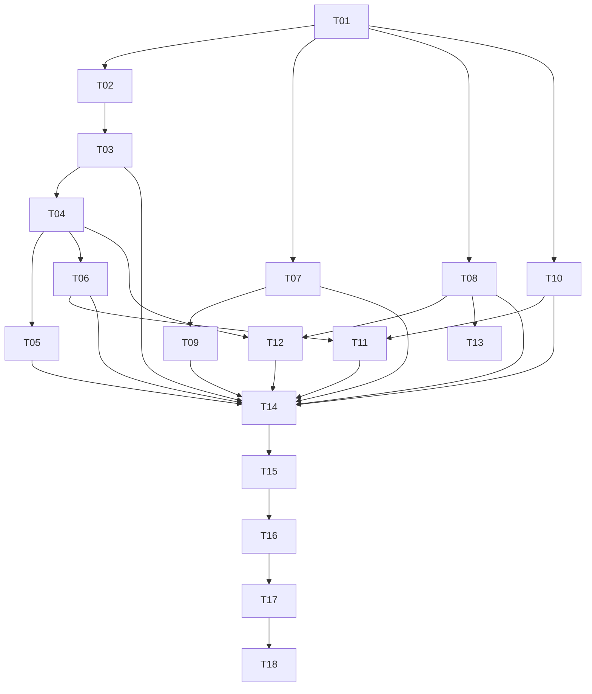

# Docmost MCP 与向量搜索加固实施计划

## 1. 计划概览

- 规划深度：完整实施计划。
- 实施目标：解决当前审查确认的权限、隐私、可靠性、一致性、检索质量、可观测性、测试和发布问题，使 MCP 可以在真实知识库上安全运行。
- 当前状态：已批准，正在执行。
- 发布策略：先在本地与一次性数据库完成验证，再部署到香港 VPS，仅对白名单测试空间启用，最后逐空间放量。
- 核心退出标准：受限内容不会进入 Embedding 请求；故障后任务和写操作可恢复；全部 P0/P1 自动化通过；真实 Codex 客户端验收通过；监控和回滚路径可用。

## 2. 范围与约束

### 2.1 本轮包含

- 页面级向量索引授权与权限撤销清理。
- BullMQ 持久化索引队列、分页回填、自动重试、超时与恢复。
- 幂等租约、结果收敛、失败恢复与数据清理。
- Token/权限管理操作的事务审计。
- MCP 页面元数据与 Yjs 正文更新的一致性保护。
- 向量维度约束、语义结果去重、混合排序与重复 Embedding 消除。
- Prometheus 指标、结构化日志、告警与审计覆盖。
- 管理员 UI：客户端、Token、空间权限和审计日志。
- 可提交的单元、集成、E2E、故障注入和迁移回滚测试。
- Docker/环境示例、Supabase 暴露面检查、Codex 实际连接和灰度部署。

### 2.2 本轮明确不包含

- MCP 永久删除页面：继续只支持软删除与恢复。
- MCP 自行修改自己的权限：继续通过管理员 API/UI 管理，防止自提权。
- Docmost 商业 AI 功能或 License 绕过。
- 附件 OCR、音视频转写与附件向量化。
- 公共多租户 SaaS 级防滥用体系。
- stdio 适配器：远程 Codex 继续使用 Streamable HTTP；仅在实际兼容性要求出现时另立任务。

### 2.3 固定技术决策

- 向量索引资格：页面必须位于至少一个启用 `canIndex` 的活动 MCP 客户端空间内，并且该客户端映射 actor 具备原生页面读取权限。
- 自动页面事件也必须经过同一资格服务；没有资格时不得调用 Embedding，并软删除现有活动 chunks。
- 当前版本只支持 `vector(1536)`；其他维度必须通过后续显式数据库迁移支持，不允许仅改环境变量。
- 审计要求：Token、权限和写操作必须做到事务内落审计或通过持久化 outbox 最终落审计，不允许“业务成功但接口假失败”。
- 索引任务以 BullMQ 为执行事实来源，`docmost_mcp_index_jobs` 保留为查询、审计和恢复状态表。

## 3. 阶段与发布门槛

| 阶段 | 目标                 | 进入条件     | 退出条件                               | 依赖   |
| ---- | -------------------- | ------------ | -------------------------------------- | ------ |
| M0   | 固化基线与契约       | 本计划获批准 | 基线测试可重复，设计与任务状态同步     | 无     |
| M1   | 封住索引隐私边界     | M0 完成      | 受限页面在所有入口都不会触发 Embedding | M0     |
| M2   | 建成可靠索引管线     | M1 完成      | 重启、超时、重试、超过 1000 页均可收敛 | M1     |
| M3   | 修复写入一致性       | M1 完成      | 幂等、审计、Token 与页面写入故障可恢复 | M1     |
| M4   | 修复检索与配置正确性 | M2 完成      | 维度、去重、排序和内容哈希行为确定     | M2     |
| M5   | 补齐运维与管理能力   | M2、M3 完成  | 指标、告警、权限拒绝审计和管理 UI 可用 | M2、M3 |
| M6   | 完整自动化与迁移演练 | M1-M5 完成   | P0/P1 全通过，up/down/up 可重复        | M1-M5  |
| M7   | Codex 验收与灰度发布 | M6 完成      | 非敏感空间稳定后逐空间放量             | M6     |

## 4. 任务清单

## Task T01

```yaml
task_id: T01
title: 固化基线与安全契约
status: completed
owner: agent
stream: architecture
type: design-and-test
priority: P0
depends_on: []
requires_manual_gate: true
```

### Goal

将本轮固定技术决策同步到设计文档，并保留一份当前可重复测试基线。

### Scope

- `specs/docmost-mcp-vector/design.md`
- `specs/docmost-mcp-vector/test-plan.md`
- MCP 与 Page 现有测试套件

### Steps

1. 更新向量索引资格、审计一致性、维度限制和发布策略。
2. 记录现有单元、E2E、构建、类型、Lint 和敏感信息扫描结果。
3. 将当前行为与后续预期行为区分，避免测试把缺陷固化为契约。

### Validation

- 现有 10 个单元套件、P0 权限 E2E、并发 E2E、构建和类型检查全部保持通过。

### Done When

- 设计没有相互矛盾的索引、审计或维度描述。
- 用户批准计划后，将 `tasks.md` 与 `design.md` 标为 approved。

### Rollback / Guardrail

- 本任务只改文档和测试基线，不改变运行时行为。

## Task T02

```yaml
task_id: T02
title: 实现统一的向量索引资格服务
status: completed
owner: agent
stream: security
type: backend
priority: P0
depends_on: [T01]
requires_manual_gate: false
```

### Goal

所有页面索引入口共享同一套 MCP 空间权限与 Docmost actor 页面权限判断。

### Scope

- 新增 `McpVectorEligibilityService`
- `McpPermissionService`
- `McpActorAccessService`
- `McpVectorIndexService`

### Steps

1. 查询活动、未过期、未删除且 `canIndex=true` 的客户端权限。
2. 校验 actor 存在、启用且属于同一 workspace。
3. 通过原生 `PagePermissionRepo` 过滤可读页面。
4. 返回可索引页面及授权来源，不在 job/error 中暴露页面正文。
5. 对无资格页面返回明确的内部 skip 原因，不调用 Embedding。

### Validation

- 空间允许但页面受限、actor 删除/禁用、权限删除、跨 workspace 均不得调用 provider。
- 至少一个合法 actor 可读时页面可以索引。

### Done When

- 单页、空间、工作区和自动事件入口都只能通过资格服务取得页面。

### Rollback / Guardrail

- `VECTOR_SEARCH_ENABLED=false` 继续作为总开关。

## Task T03

```yaml
task_id: T03
title: 接入所有索引入口并处理权限撤销
status: completed
owner: agent
stream: security
type: backend
priority: P0
depends_on: [T02]
requires_manual_gate: false
```

### Goal

消除页面事件、批量重建和重试绕过页面级权限的路径。

### Scope

- `McpVectorIndexListener`
- `reindex_page`、`reindex_space`、`reindex_workspace`、`retry_index_job`
- 权限 upsert/delete、client disable/delete/actor 变更流程

### Steps

1. 页面事件在入队前执行资格判断。
2. 批量重建逐批过滤页面，而不是只检查空间成员身份。
3. 重试时重新计算当前资格，不复用旧权限快照。
4. 权限撤销、client 禁用/删除或 actor 失效后，检查是否仍有其他合法索引资格；没有时软删除 chunks。
5. 加入 `skipped_permission` 状态/统计，不记录敏感正文。

### Validation

- 使用 provider spy 证明受限正文从未出现在请求体。
- 权限撤销后 chunks 不再可搜索；其他合法客户端仍有资格时不误删。

### Done When

- P0 隐私问题关闭并有真实 PostgreSQL E2E 证据。

### Rollback / Guardrail

- 上线前只在无敏感内容的测试空间启用向量功能。

## Task T04

```yaml
task_id: T04
title: 将索引执行迁移到 BullMQ
status: completed
owner: agent
stream: reliability
type: backend
priority: P1
depends_on: [T03]
requires_manual_gate: false
```

### Goal

替换进程内 `setTimeout`，保证任务在进程重启和短暂依赖故障后继续执行。

### Scope

- 新建 vector queue producer/processor
- `docmost_mcp_index_jobs`
- Redis/BullMQ 配置

### Steps

1. 定义 page/delete/restore/space/workspace job payload 和稳定 jobId。
2. 先持久化状态行，再原子/可补偿地入 BullMQ。
3. processor 使用 compare-and-set 获取执行权，防止同一 job 并发执行。
4. 配置指数退避、最大尝试次数、stalled job 恢复和死信状态。
5. 启动时扫描孤立 queued/running 状态并与 BullMQ 对账。
6. 移除全部 timer 驱动执行路径。

### Validation

- 在 queued、running、provider call 后分别杀进程，重启后任务最终收敛且不重复写坏 chunks。

### Done When

- 没有运行时索引任务依赖进程内定时器。

### Rollback / Guardrail

- 可停止独立 processor，同时保留普通 Docmost 与关键词搜索。

## Task T05

```yaml
task_id: T05
title: 实现完整分页回填与任务去重
status: completed
owner: agent
stream: reliability
type: backend
priority: P1
depends_on: [T04]
requires_manual_gate: false
```

### Goal

空间和工作区重建覆盖任意数量页面，并避免事件和 MCP 写入生成重复任务。

### Steps

1. 使用稳定的 `(updatedAt, id)` 或 `id` 游标分页，不使用一次性 `limit 1000` 截断。
2. 将批次游标、扫描数、跳过数写入 parent job stats。
3. 为同一 page/model/contentHash 建立任务去重键。
4. 页面事件与 MCP 显式入队合并到同一去重入口。
5. 允许暂停、继续和取消长回填。

### Validation

- 构造至少 1501 页，确保每页只被扫描且成功处理一次。
- 重复事件、并发重建和重启不会导致重复 provider 调用失控。

### Done When

- `reindex_space/workspace` 的“全部页面”描述与实际行为一致。

## Task T06

```yaml
task_id: T06
title: 增加 Embedding 超时、重试与内容哈希复用
status: completed
owner: agent
stream: reliability
type: backend
priority: P1
depends_on: [T04]
requires_manual_gate: false
```

### Goal

供应商卡顿不会无限占用任务，未变化内容不会重复计费。

### Steps

1. 增加经过校验的 `EMBEDDING_TIMEOUT_MS` 和 retry 配置。
2. 使用 AbortSignal/AbortController 主动取消超时请求。
3. 只对可重试网络错误、429 和 5xx 退避重试；4xx 配置错误直接失败。
4. 在调用 provider 前比较 model、dimensions、chunkIndex、contentHash，复用未变化 embedding。
5. provider 错误只保存安全摘要，不保存正文、Token 或 API key。

### Validation

- 覆盖超时、429、502、无效 JSON、数量错误、非数值、维度错误和部分批次失败。
- 未变化页面重建时 provider 调用数为 0。

### Done When

- 所有 provider 调用都有确定超时，任务状态不会无限 running。

## Task T07

```yaml
task_id: T07
title: 为幂等记录增加租约与恢复状态机
status: completed
owner: agent
stream: consistency
type: schema-and-backend
priority: P1
depends_on: [T01]
requires_manual_gate: false
```

### Goal

解决崩溃残留 `response=null`、成功副作用后结果丢失和记录无限增长。

### Steps

1. 迁移增加 `status`、`lease_owner`、`lease_expires_at`、`completed_at` 和明确 `expires_at`。
2. 使用原子 compare-and-set 获取或续租执行权。
3. 超时 reservation 不直接盲目重放；先通过 resourceId/action reconciliation 判断副作用是否已完成。
4. 成功副作用与可查询响应尽量在同一事务完成；无法同事务时持久化 operation stage。
5. 增加定期清理 completed/failed 过期记录的任务。

### Validation

- 在 reservation 后、业务提交后、response 写回前注入崩溃并验证重试收敛。
- 并发同 key 仍只执行一次副作用；不同请求 hash 继续冲突。

### Done When

- 不存在永久 `in progress` 状态，重试不会重复创建或追加。

## Task T08

```yaml
task_id: T08
title: 事务化 Token 与权限审计
status: completed
owner: agent
stream: consistency
type: backend
priority: P1
depends_on: [T01]
requires_manual_gate: false
```

### Goal

创建、轮换、禁用、删除客户端及权限变更不会因审计失败产生假失败或丢失一次性 Token。

### Steps

1. 让 `McpAuditService` 支持传入 Kysely transaction。
2. Token/client/permission 数据修改与审计插入放入同一事务。
3. 轮换只有在事务提交后返回新 Token；事务失败时旧 Token 仍有效。
4. 对无法同事务的操作使用 outbox，并在响应中返回可恢复 operationId。
5. 删除未被调用的权限拒绝审计死路径，改为真实接入。

### Validation

- 注入 audit insert 失败：创建不留下 client，轮换不使旧 Token 失效，权限不发生半更新。

### Done When

- Token 生命周期操作不存在“成功但拿不到 Token”的路径。

## Task T09

```yaml
task_id: T09
title: 保护页面元数据与 Yjs 正文更新一致性
status: completed
owner: agent
stream: consistency
type: backend
priority: P1
depends_on: [T07]
requires_manual_gate: false
```

### Goal

正文转换或协作服务失败时，页面不会静默停留在半更新状态，重试能够收敛。

### Steps

1. 在更新任何元数据前完成格式、长度和 ProseMirror 转换验证。
2. 为 MCP update/append 建立 operation stage，记录旧 metadata/content hash 与目标 hash。
3. 失败时执行确定性补偿；补偿失败则标记 `repair_required` 并进入恢复队列。
4. 将 `expectedUpdatedAt` 与 operationId 绑定，避免重试被自身的部分更新误判为外部冲突。
5. 保持浏览器现有协作路径兼容，不做无关 PageService 重构。

### Validation

- 注入转换、Redis、Yjs、数据库和审计各阶段失败。
- 每种失败最终为完整旧状态、完整新状态或明确可恢复状态，不能静默半完成。

### Done When

- MCP 写请求可安全重试，恢复任务能够处理残留 operation。

## Task T10

```yaml
task_id: T10
title: 固定并验证向量维度契约
status: completed
owner: agent
stream: schema
type: config-and-migration
priority: P1
depends_on: [T01]
requires_manual_gate: false
```

### Goal

环境配置不再允许与 `vector(1536)` 不兼容的维度。

### Steps

1. 当前版本将 `EMBEDDING_DIMENSIONS` 限定为 `1536`。
2. 启动时查询/验证数据库向量 typmod 与配置一致。
3. 错误信息明确说明更换维度需要迁移和全量重建。
4. 在设计中记录未来多维度迁移方案，不在本轮动态改变 schema。

### Validation

- 1536 正常启动；其他值在启动阶段失败，且不会等到首个索引任务才报错。

### Done When

- 不存在“配置校验通过但写数据库必失败”的组合。

## Task T11

```yaml
task_id: T11
title: 修复语义去重与混合排序
status: completed
owner: agent
stream: search
type: backend
priority: P2
depends_on: [T06, T10]
requires_manual_gate: false
```

### Goal

每个页面只返回最佳分块，混合排序不会被后续低分分块覆盖，并实现设计中的 recency 权重。

### Steps

1. 在 SQL 层按 page 取最高 semantic score，同时保留最佳 snippet/chunk 元数据。
2. 对 keyword/semantic 分数做稳定归一化。
3. 按设计实现 semantic、keyword、recency 权重，并返回各分量。
4. 以页面为单位合并，确保排序确定性和分页稳定。

### Validation

- 多分块同页、关键词独有、语义独有、混合命中和相同分数均有测试。

### Done When

- 结果无重复 pageId，最佳分块不会被较低分覆盖。

## Task T12

```yaml
task_id: T12
title: 补齐 MCP 指标、日志与告警
status: completed
owner: agent
stream: observability
type: backend-and-ops
priority: P1
depends_on: [T04, T08]
requires_manual_gate: false
```

### Goal

上线后可以判断请求、权限、写入、索引和 provider 是否健康。

### Steps

1. 增加请求数、延迟、权限拒绝、写操作、audit failure、embedding 延迟、job 状态和 backlog 指标。
2. 接入权限拒绝审计，默认不记录正文和完整 Token。
3. 统一 requestId、clientId、workspaceId、toolName 和 jobId 结构化日志字段。
4. 配置告警：审计失败、任务失败率、running 超时、队列积压、provider p95 和认证失败突增。
5. 添加 Grafana 看板或复用现有看板并记录查询与阈值。

### Validation

- 故障注入时指标、日志和告警能定位问题且敏感扫描通过。

### Done When

- 每个发布阻断条件都有可观测信号和明确阈值。

## Task T13

```yaml
task_id: T13
title: 实现 MCP 管理员界面
status: completed
owner: agent
stream: frontend
type: full-stack
priority: P2
depends_on: [T08]
requires_manual_gate: false
```

### Goal

管理员无需手工调用 API 即可安全管理 MCP 客户端和空间权限。

### Scope

- 客户端列表、创建、编辑、禁用、删除、轮换
- 一次性 Token 展示与确认
- 空间权限矩阵
- 审计日志筛选与详情

### Validation

- 普通成员不可访问；管理员权限与 API 行为一致。
- Token 只展示一次，不进入前端日志、URL、localStorage 或错误追踪。
- 桌面与移动端无布局重叠，并通过浏览器 E2E。

### Done When

- 管理员可以完成完整 Token 与权限生命周期操作。

## Task T14

```yaml
task_id: T14
title: 提交完整 P0/P1 自动化测试
status: completed
owner: agent
stream: qa
type: tests
priority: P0
depends_on: [T03, T04, T05, T06, T07, T08, T09, T10, T11, T12]
requires_manual_gate: false
```

### Goal

把临时 runner 中的证据转成仓库内可重复运行的测试。

### Steps

1. 实现 `G-01` 至 `G-61` 中所有 P0/P1 场景，合并重复用例。
2. 增加两 workspace、多 actor、多受限页面、低限流和 provider stub fixture。
3. 增加 JSON-RPC notification/batch/version、真实 SDK client 握手测试。
4. 增加队列重启、lease、事务审计和部分写入故障注入。
5. 将数据库、Redis、server、mock provider 生命周期封装进可重复脚本。
6. 在 CI 中运行单元、集成、E2E、类型、Lint、格式和敏感扫描。

### Validation

- 后端核心安全服务行覆盖率不低于 90%，分支覆盖率不低于 80%。
- 所有公开方法、错误分支和跨 workspace 边界有测试。

### Done When

- 不再依赖 `/private/tmp` runner 才能证明关键行为。

## Task T15

```yaml
task_id: T15
title: 验证迁移回滚与 Supabase 暴露面
status: completed
owner: agent
stream: database
type: migration-and-security
priority: P1
depends_on: [T07, T10, T14]
requires_manual_gate: true
```

### Goal

证明 schema 可重复迁移，并确保 MCP、audit、idempotency 和 chunks 表不会被 Supabase Data API 意外公开。

### Steps

1. 在一次性数据库执行 latest -> down -> up -> app boot。
2. 检查表、约束、索引、pgvector extension 和基础 Docmost 表完整性。
3. 检查 Supabase exposed schemas、table grants、anon/authenticated 访问与 RLS 状态。
4. 选择禁用 Data API 暴露、移出 exposed schema、REVOKE 或显式 deny policy 中与 Docmost 架构兼容的方案。
5. 记录生产迁移备份、回滚和不可逆向量数据处理说明。

### Validation

- anon/authenticated key 无法读取任何 MCP 敏感表。
- migration down 不删除正常 Docmost 数据。

### Done When

- `G-01/G-02` 自动化通过，Supabase 安全检查无高风险项。

## Task T16

```yaml
task_id: T16
title: 完成 Docker 与生产配置文档
status: completed
owner: agent
stream: deployment
type: ops
priority: P1
depends_on: [T12, T15]
requires_manual_gate: false
```

### Goal

生产镜像和环境配置可以从 Git 版本稳定复现。

### Steps

1. 添加环境变量示例，所有 secret 只放 Vaultwarden/部署环境。
2. 配置 Docmost server、vector worker、Redis 和健康检查。
3. Nginx 仅通过 HTTPS 暴露 MCP，设置请求大小、超时和必要访问控制。
4. 记录 feature switches、provider 配置、队列并发、告警阈值和回滚命令。
5. 将当前未跟踪文件纳入明确的 Git 提交序列，不混入无关改动。

### Validation

- 从干净 clone 构建镜像并启动全部服务。
- secret 扫描和镜像配置检查通过。

### Done When

- 不依赖当前开发机状态即可部署相同版本。

## Task T17

```yaml
task_id: T17
title: 真实 Codex 客户端端到端验收
status: completed
owner: agent
stream: integration
type: e2e
priority: P1
depends_on: [T14, T16]
requires_manual_gate: true
```

### Goal

证明实际 Codex 能完成连接、发现、搜索、读写、软删除恢复和错误处理。

### Steps

1. 创建独立测试 actor、MCP client 和非敏感测试空间。
2. 通过 HTTPS Streamable HTTP 配置 Codex MCP。
3. 验证 initialize、tools/list、搜索、CRUD、confirm、并发冲突、限流和 token rotation。
4. 验证 Codex 重连不会重复创建/追加，provider 降级时关键词搜索仍可用。
5. 检查服务日志、指标、audit 和 chunks 与预期一致。

### Done When

- Codex 连续完成全流程，服务重启后自动恢复且无数据泄露。
- 2026-07-10 本地生产构建已由 `codex-cli 0.142.5` 完成搜索、读取、CRUD、幂等、限流恢复、审计与 Token 轮换验收。

## Task T18

```yaml
task_id: T18
title: 香港 VPS 灰度发布与逐空间放量
status: in_progress
owner: agent
stream: release
type: deployment
priority: P1
depends_on: [T17]
requires_manual_gate: true
```

### Goal

以最小真实数据范围上线，并能够快速停止 MCP 或向量功能。

### Steps

1. 备份数据库并先部署 `MCP_ENABLED=false`、`VECTOR_SEARCH_ENABLED=false`。
2. 执行迁移和健康检查，再仅启用 MCP 关键词路径。
3. 对一个无敏感内容的测试空间启用 index/semantic 权限。
4. 观察至少 24 小时：错误率、p95、audit failure、queue backlog、provider failure、stale pages。
5. 达标后逐空间授权；含密钥/凭证的空间默认永不授权。
6. 出现隐私、审计或一致性异常时立即关闭 vector/MCP 开关，保留数据供排查。

### Current Evidence (2026-07-11)

- 香港 VPS 已部署不可变镜像 `docmost-mcp-vector-v0.1.0-rc.5`，生产备份、真实恢复演练和快速回滚文件均已验证。
- 已完成双开关关闭的暗启动，随后仅启用 `MCP_ENABLED=true`；`VECTOR_SEARCH_ENABLED=false` 保持关闭。
- 灰度客户端 `Codex Canary - General` 只授权空的私有 `General` 空间；允许关键词搜索、读取、创建、修改和追加，拒绝删除、恢复、语义搜索和索引。
- 生产 HTTPS 回归通过搜索、读取、创建、修改、追加与幂等重放；删除权限以 not-found 方式隐藏资源存在性，语义搜索返回空结果，索引操作明确拒绝。
- 隔离的 `codex-cli 0.144.0-alpha.4` 使用官方 ChatGPT 登录完成生产 `search_docs` 与 `get_page`，未加载自定义 provider 或其他 MCP。
- 当前证据为 26 次 MCP 请求、0 次 Embedding 调用、0 个活动 vector chunk、0 个索引任务；Docmost `healthy`、重启次数 0，Nginx 正常。
- 24 小时观察窗口和单空间 vector/semantic 灰度尚未完成，T18 不得提前标记为 completed。

### Done When

- 观察窗口内无 P0/P1 异常，回滚演练成功，生产权限清单经人工确认。

## 5. 依赖关系



可并行执行：

- T04-T06 与 T07-T10 在 T03 完成后可分为“索引可靠性”和“写入一致性”两条支线。
- T11、T12、T13 可在对应后端依赖完成后并行。
- T13 不阻塞核心安全测试，但必须在最终产品完整验收前完成。

## 6. 问题覆盖映射

| 已确认问题或缺失功能         | 覆盖任务      | 主要验收                |
| ---------------------------- | ------------- | ----------------------- |
| 受限页面可能进入 Embedding   | T02, T03, T14 | provider spy 无敏感正文 |
| timer 任务重启丢失           | T04, T14      | kill/restart 故障注入   |
| 重建最多 1000 页             | T05, T14      | 1501 页完整回填         |
| 重复任务与重复 Embedding     | T05, T06      | provider 调用计数       |
| provider 无超时/退避         | T06, T14      | timeout/429/5xx 场景    |
| 幂等 reservation 永久占用    | T07, T14      | 崩溃恢复与并发测试      |
| 审计失败导致 Token 丢失      | T08, T14      | audit failure 回滚测试  |
| 元数据与正文半更新           | T09, T14      | Redis/Yjs/DB 故障注入   |
| 环境维度与 vector(1536) 冲突 | T10, T15      | 启动前配置检查          |
| 语义重复与低分覆盖           | T11, T14      | 多 chunk 排序测试       |
| 指标、告警、拒绝审计缺失     | T12           | 故障信号与敏感扫描      |
| 管理 UI 缺失                 | T13           | 管理员浏览器 E2E        |
| P1 自动化与迁移回滚缺失      | T14, T15      | CI 与 up/down/up        |
| Supabase 暴露面未确认        | T15           | anon/authenticated 拒绝 |
| Docker/环境文档缺失          | T16           | 干净 clone 部署         |
| 真实 Codex 未验收            | T17           | 实际客户端全流程        |
| 香港 VPS 关键词灰度观察中    | T18           | 24 小时观察与向量灰度   |

## 7. 风险与阻断条件

| ID   | 风险或阻断                       | 影响                   | 处理                                  |
| ---- | -------------------------------- | ---------------------- | ------------------------------------- |
| R-01 | 向量资格定义错误                 | 敏感正文外发           | T02/T03 完成前禁止真实数据向量化      |
| R-02 | Yjs 无法与 PostgreSQL 共用事务   | 可能半更新             | operation state + 补偿 + repair queue |
| R-03 | BullMQ 与状态表双写不一致        | 孤立任务               | 对账器、稳定 jobId、幂等 processor    |
| R-04 | Supabase Data API 暴露 public 表 | MCP 配置和 chunks 泄露 | T15 人工安全门禁                      |
| R-05 | provider 变更向量维度            | 全量索引失败           | v1 固定 1536，变更走迁移              |
| R-06 | 工作区存在密钥类空间             | 高隐私风险             | 默认无权限，逐空间人工授权            |
| R-07 | 当前改动未提交                   | CI/部署不可复现        | T16 前分阶段精确提交                  |

## 8. 总体验收标准

1. 所有 P0、P1 任务完成，P2 管理 UI 与检索质量任务完成或由用户明确再次延期。
2. 受限页面、未授权空间和失效 actor 的正文从未进入 provider 请求、chunks、日志或错误响应。
3. 进程、Redis、provider、数据库和 audit 故障均有自动恢复或明确可执行的补偿路径。
4. 1501 页回填、并发幂等、Token 审计、页面部分写入、迁移回滚全部有 CI 证据。
5. 单元、集成、E2E、构建、TypeScript、ESLint、Prettier、diff check 和 secret scan 全部通过。
6. Supabase anon/authenticated 无法访问 MCP 敏感表。
7. 从干净 Git clone 可以构建并部署相同镜像。
8. 实际 Codex MCP 全流程通过，香港 VPS 灰度观察窗口健康，关闭开关可立即停止风险路径。
